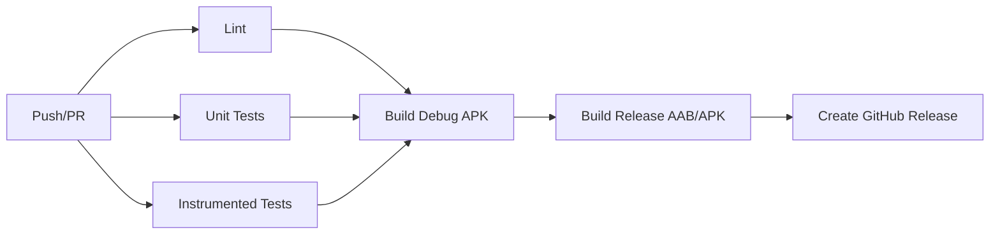

<div align="center">

</div>

# پروکسی هاب و تستر کانفیگ 🚀

**ابزار تخصصی دریافت، استخراج، تست سرعت و پینگ، جداسازی و فیلتر کانفیگ‌های V2Ray و پروکسی‌های تلگرام از کانال‌ها با قابلیت حذف خودکار کانفیگ‌های خراب**

[](https://github.com/koko99900/proxy-hub-android/actions/workflows/android-ci.yml)
[](https://github.com/koko99900/proxy-hub-android/actions/workflows/dependabot.yml)
[](https://github.com/koko99900/proxy-hub-android/releases)
[](LICENSE)
[](https://android-arsenal.com/api?level=24)
[](https://kotlinlang.org)
[](https://developer.android.com/jetpack/compose)

---

## 📱 پیش‌نمایش اپلیکیشن

| صفحه اصلی | کانفیگ‌ها | پروکسی‌ها | کانال‌ها | ابزارها |
|:---:|:---:|:---:|:---:|:---:|
|  |  |  |  |  |

> **نکته:** عکس‌های بالا.placeholder هستند. پس از اولین بیلد، اسکرین‌شات‌های واقعی جایگزین می‌شوند.

---

## ✨ ویژگی‌های اصلی

### 🔍 **استخراج هوشمند کانفیگ**
- **پشتیبانی از فرمت‌های متعدد:** VLESS, VMess, Trojan, Shadowsocks, Hysteria, TUIC, WireGuard
- **استخراج از متن ساده، Base64، URI، QR Code**
- **پارسیнг کانال‌های تلگرام** (پیام‌ها، فایل‌ها، لینک‌ها)

### ⚡ **تست و پروفایل‌سازی**
- **تست پینگ (ICMP/TCP)** با تایم‌اوت قابل تنظیم
- **تست سرعت دانلود/آپلود** از طریق پروکسی
- **بررسی پورت و پروتکل** (HTTP, SOCKS5, TLS)
- **امتیازدهی خودکار** بر اساس(latency, throughput, reliability)

### 🧹 **فیلتر و تمیزکاری خودکار**
- **حذف کانفیگ‌های تکراری** (بر اساس fingerprint)
- **شناسایی و حذف کانفیگ‌های منقضی/خراب**
- **گروه‌بندی بر اساس کشور، پروتکل، کیفیت**
- **نظارت بر تغییرات کانال‌ها** (WebSocket/Long Polling)

### 🤖 **هوش مصنوعی (Gemini AI)**
- **تحلیل کانفیگ‌ها** و پیشنهاد بهترین تنظیمات
- **تولید گزارش‌های خلاصه** برای اشتراک‌گذاری
- **پاسخ به سوالات فنی** در مورد پروتکل‌ها

### 💾 **ذخیره‌سازی و همگام‌سازی**
- **Room Database** برای ذخیره آفلاین
- **Export/Import** به فرمت JSON، YAML، Clash، Sing-box
- **QR Code** برای اشتراک‌گذاری سریع

---

## 🛠 تکنولوژی‌ها

| لایه | تکنولوژی | نسخه |
|------|-----------|-------|
| **زبان** | Kotlin | 2.0.0 |
| **UI** | Jetpack Compose / Material 3 | 1.6.x |
| **معماری** | MVVM + Repository + UseCase | - |
| **DI** | Hilt / Koin | - |
| **DB** | Room (SQLite) | 2.6.x |
| **Network** | Retrofit + OkHttp + Moshi | Latest |
| **Async** | Coroutines + Flow | 1.7.x |
| **AI** | Firebase AI (Gemini) | Latest |
| **Test** | JUnit, Robolectric, Roborazzi | Latest |
| **CI/CD** | GitHub Actions | - |
| **Build** | Gradle (KTS) + KSP | 8.5+ |

---

## 🚀 شروع سریع

### پیش‌نیازها
- **Android Studio** Ladybug 2024.2.1 یا جدیدتر
- **JDK 17** (Temurin توصیه شده)
- **Android SDK 36** (API Level 36)
- **Gemini API Key** از [Google AI Studio](https://aistudio.google.com/apikey)

### نصب و اجرا

```bash
# 1. کلون مخزن
git clone https://github.com/koko99900/proxy-hub-android.git
cd proxy-hub-android

# 2. فایل محیطی بسازید
cp .env.example .env
# فایل .env را باز کنید و GEMINI_API_KEY را ست کنید
# GEMINI_API_KEY=your_actual_key_here

# 3. در Android Studio باز کنید
# File → Open → پوشه proxy-hub-android

# 4. برای Debug: خط زیر را در app/build.gradle.kts کامنت/حذف کنید
# signingConfig = signingConfigs.getByName("debugConfig")

# 5. Run بزنید (▶️) روی امولاتور یا گوشی فیزیکی
```

### بیلد از خط فرمان

```bash
# Debug APK (بدون امضای релиز)
./gradlew assembleDebug

# Release AAB (برای Play Store - نیازمند Keystore)
./gradlew bundleRelease \
  -PstorePassword=$STORE_PASSWORD \
  -PkeyPassword=$KEY_PASSWORD \
  -PkeystorePath=$KEYSTORE_PATH

# Release APK (برای نصب مستقیم)
./gradlew assembleRelease \
  -PstorePassword=$STORE_PASSWORD \
  -PkeyPassword=$KEY_PASSWORD \
  -PkeystorePath=$KEYSTORE_PATH
```

---

## 🔐 متغیرهای محیطی

فایل `.env` (یا GitHub Secrets برای CI):

| متغیر | توضیح | ضروری |
|----------|--------|-------|
| `GEMINI_API_KEY` | کلید API Gemini برای ویژگی‌های AI | ✅ بله |
| `STORE_PASSWORD` | رمز Keystore (Release) | برای Release |
| `KEY_PASSWORD` | رمز کلید (Release) | برای Release |
| `KEYSTORE_PATH` | مسیر فایل Keystore | برای Release |
| `KEYSTORE_BASE64` | Keystore در Base64 (برای CI) | برای CI Release |

---

## 📦 خروجی‌های بیلد

| فایل | کاربرد | مکان |
|------|--------|-------|
| `app-debug.apk` | نصب و تست مستقیم | `app/build/outputs/apk/debug/` |
| `app-release.aab` | آپلود به Google Play Console | `app/build/outputs/bundle/release/` |
| `app-release.apk` | نصب مستقیم (امضا شده) | `app/build/outputs/apk/release/` |

---

## 🧪 تست‌ها

```bash
# تست‌های واحد (JVM)
./gradlew testDebugUnitTest

# تست‌های ابزارآزمایی (Instrumented - نیازمند امولاتور)
./gradlew connectedDebugAndroidTest

# تست‌های UI با Roborazzi (اسکرین‌شات)
./gradlew recordRoborazziDebug

# گزارش پوشش کد (Jacoco)
./gradlew jacocoTestReport
```

---

## 🔄 CI/CD Pipeline

GitHub Actions workflow (`.github/workflows/android-ci.yml`):



### آرتیفکت‌های CI
- **Debug APK** - هر Push/PR (30 روز نگهداری)
- **Release AAB/APK** - فقط Push به master (90 روز نگهداری)
- **Lint Report** - HTML گزارش
- **Test Reports** - JUnit XML

### Secrets مورد نیاز برای Release
در Settings → Secrets → Actions اضافه کنید:
```
GEMINI_API_KEY
KEYSTORE_BASE64        # base64 encoded keystore
STORE_PASSWORD
KEY_PASSWORD
KEYSTORE_PATH          # معمولاً my-upload-key.jks
```

---

## 📁 ساختار پروژه

```
proxy-hub-android/
├── .github/
│   ├── workflows/
│   │   └── android-ci.yml          # CI/CD Pipeline
│   └── dependabot.yml              # Dependency updates
├── app/
│   ├── src/
│   │   ├── main/
│   │   │   ├── java/com/example/
│   │   │   │   ├── data/
│   │   │   │   │   ├── model/      # Entities (Room)
│   │   │   │   │   ├── db/         # Room Database, DAOs
│   │   │   │   │   ├── parser/     # ConfigParser (VLESS, VMess, ...)
│   │   │   │   │   ├── fetcher/    # ChannelFetcher (Telegram)
│   │   │   │   │   ├── tester/     # PingTester, SpeedTester
│   │   │   │   │   └── repository/ # ProxyRepository
│   │   │   │   ├── ui/
│   │   │   │   │   ├── screens/    # Compose Screens
│   │   │   │   │   ├── components/ # Reusable Components
│   │   │   │   │   ├── theme/      # Material3 Theme
│   │   │   │   │   └── viewmodel/  # ViewModels
│   │   │   │   └── MainActivity.kt
│   │   │   ├── res/                # Resources
│   │   │   └── AndroidManifest.xml
│   │   ├── test/                   # Unit Tests
│   │   └── androidTest/            # Instrumented Tests
│   ├── build.gradle.kts
│   └── proguard-rules.pro
├── gradle/
│   └── libs.versions.toml          # Version Catalog
├── build.gradle.kts
├── settings.gradle.kts
├── gradle.properties
├── .env.example
├── metadata.json
└── README.md
```

---

## 🤝 مشارکت

1. Fork کنید
2. Branch بسازید: `git checkout -b feature/amazing-feature`
3. Commit کنید: `git commit -m 'feat: add amazing feature'`
4. Push کنید: `git push origin feature/amazing-feature`
5. Pull Request باز کنید

### Convension Commit
```
feat:     ویژگی جدید
fix:      رفع باگ
docs:     مستندات
style:    فرمت‌بندی
refactor: بازنویسی
test:     تست
chore:    ابزار/بیلد
```

---

## 📋 Roadmap

- [ ] **v1.1** - پشتیبانی از Sing-box / Clash Meta
- [ ] **v1.2** - همگام‌سازی ابری (Firebase/Supabase)
- [ ] **v1.3** - ویجت صفحه اصلی اندروید
- [ ] **v1.4** - támogat پروتکل‌های جدید (Hysteria2, TUIC v5)
- [ ] **v2.0** - رابط کاربری دسکتاپ (Compose Multiplatform)

---

## 🐛 گزارش باگ / درخواست فیچر

- **Bug Report:** [Issue Template](.github/ISSUE_TEMPLATE/bug_report.yml)
- **Feature Request:** [Issue Template](.github/ISSUE_TEMPLATE/feature_request.yml)
- **Question:** [Discussions](https://github.com/koko99900/proxy-hub-android/discussions)

---

## ⚖️ مجوز

این پروژه تحت مجوز **MIT License** منتشر شده است. فایل [LICENSE](LICENSE) را ببینید.

---

## 🙏 تشکر

- [Google AI Studio](https://ai.studio) برای Gemini API
- [Android Developers](https://developer.android.com) برای مستندات عالی
- جامعه متن‌باز اندروید و Kotlin

---

<div align="center">
<strong>ساخته شده با ❤️ توسط <a href="https://github.com/koko99900">koko99900</a></strong>
<br>
<a href="https://github.com/koko99900/proxy-hub-android/stargazers">⭐ ستاره دهید اگر مفید بود!</a>
</div>
